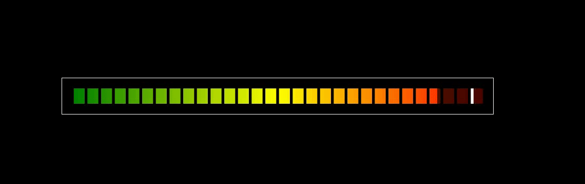

[ENGLISH](./README.md)

<h1 align="center">VolumePillar</h1>


### 基于JS+Canvas开发音量柱的实时音量电平值刷新展示。

- 音量柱支持展示白色音量值标展示。
- 音量柱支持声音递减值展示。
- 后续有时间增加竖版参数配置。
- js引入方式则需注掉export default 等导出方法。
- import 引入需使用export 导出使用。

### 使用方法

```html
<body>
    <div class="box">
        <div class="canvas_area" id="canvasArea"></div>
    </div>
    <style>
        body{
            background-color: #000;
        }
        .canvas_area {
            width: 100%;
             /* height: 40%; */
            height: 30px;
             /* background-color: #000; */
            background-image: linear-gradient(90deg, rgba(0, 128, 0, .3), rgba(255, 255, 0, .3), rgba(255, 0, 0, .3));
            position: relative;
        }
        .box{
            position: absolute;
            top: 50%;
            left: 50%;
            width: 800px;
            transform: translate(-50%,-50%);
            height: 30px;
            border: 1px solid #fff;
            padding: 20px;
        }
        *{
            padding: 0;
            margin: 0;
        }
    </style>
    <script src="./volumePillar.js"></script>
    <script>
        let volumePillar = new VolumePillar('canvasContent', 'canvasArea',['rgb(0,128,0)', 'rgb(255,255,0)', 'rgb(255,0,0)'],-54,20,50)
        setInterval(()=>{
            let val = Math.floor(Math.random()*-96+1)
            console.log('val',val);
            volumePillar._setVolumeVal([val])
        },50)
    </script>
</body>
```
### 配置项
```javascript
let volumePillar = new VolumePillar（$1,$2,$3,$4,$5,$6,$7）
//*$1(canvasId) ：指canvas生成画布的ID（结构里无需写入，组件会生成）。
//*$2(parentId) :指生成canvas画布的父标签ID（结构需手动写入）。
//$3(backGround) :当前canvas背景的颜色，如传入的参数为字符串则为单一颜色，如为数组则为渐变颜色,不传参数则默认为红黄蓝的渐变色。
//$4(dbfsMin) :最小dbfm值，值在当前显示中，坐标的最小音量值，（正常为-96则音量最小），不传默认为-54。
//$5(fps) :帧率 为1s内读取数值的总长度（1s内刷新率）,（需和参数传入的频率统一，如1s内展示20个值则传参设置音量值时也需1s内传入20个音量值进行展示），不传默认为20帧。
//$6(times) :数值上报频率/ms 如1S内展示20个值那么就是1000/20的频率 就是50ms,不传默认为1000。
//$7(splitLine) :分隔线数量，指分隔颜色快的个数，数值越大，分隔数越多,不传默认为30。

//设置方法
//设置音量值，数值需用数组格式。
//_setVolumeVal(Val<Array>)
```

<h3 align="center">示例</h3>

<p align="center">
    
</p>


Demo演示效果请移步Demo文件夹